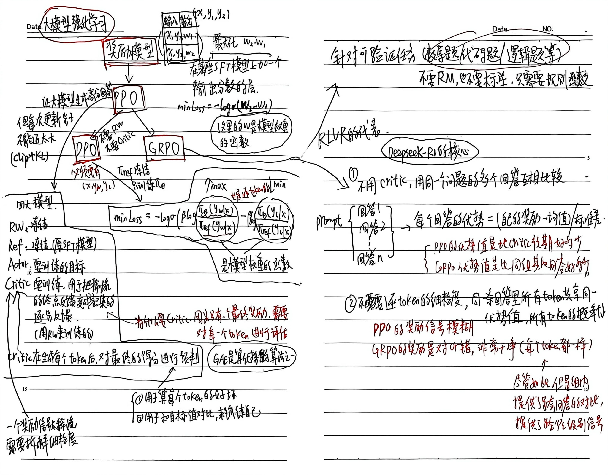

## 大模型微调全量调参数或调整部分参数
- 分类微调是在GPT结构末尾加一个分类头，logits形如【p1,p2,p3】，本质上只对最后的分类结果算交叉熵损失
- 指令微调的本质也是输出tokens的logits，也是算logits的交叉熵损失，和预训练的区别是，不对指令的部分算Loss，只关注回答的logits

- 大模型主要通过预训练获取知识，SFT的作用是教会模型更有效地利用这些知识，如果强行注入新知识，可能会增加模型的幻觉风险

- Prompt-Tuning 就是在输入前面加几个“模型自己学会的魔法词”，只训练这几个词，让模型在特定任务上表现更好，而模型本身一动不动。

## Lora 微调策略
- 是将原模型参数全部冻结，在模型的某些层旁边，添加两个可训练矩阵A和B。在训练时，原模型参数保持不动，梯度只计算A和B，只修改A和B的参数。推理时，可以把A和B的权重直接加在原权重W上（模型结构不变），也可以保留原权重和LORA模块分离

| 维度   | Adapter Tuning     | LoRA                |
| ---- | ------------------ | ------------------- |
| 本质思想 | 插入式：在层与层之间插入新的小型网络 | 并行式：在原矩阵旁并联一个低秩路径   |
| 结构影响 | 改变网络深度（层数增加）       | 改变网络宽度（增加旁路），但可合并   |
| 推理延迟 | 有增加（必须计算新增层）       | 无增加（权重可合并回原模型）      |
| 非线性  | 包含（内部通常有激活函数）      | 不包含（纯线性变换，梯度流入 A/B） |
| 微调对象 | 新增的 Adapter 模块     | 低秩矩阵 A 和 B          |

## 推理大模型

#### 训练过程

| 阶段 | 输入数据 | 训练目标 | 学到的东西 |
|---|---|---|---|
| 预训练 | 海量通用文本（网页、书籍、论文） | 预测下一个词 | 语言知识、世界知识、基本逻辑框架 |
| 推理数据微调 | 带解题步骤的推理题（数学、编程、逻辑） | 模仿解题过程 | 解题的格式、常见的推理套路 |
| 强化学习 | 大量题目（只有问题，没有答案步骤） | 最大化答案正确率 | 真正的推理策略、自我纠错、探索能力 |

#### 本质
- 本质上的确新增了大量面向推理的训练数据（思维链数据），这是让模型学会“思考格式”的基础。但数据不是全部——后续的强化学习让模型从“模仿解题”进化到“真正理解解题策略”，这才是推理能力涌现的关键。
- 一个模型打天下"的秘密就是：在训练时给它注入两种能力，在使用时用不同的提示词唤醒不同的能力。这样，你既能享受闲聊的快速响应，又能获得解决复杂问题的深度思考，而这一切都发生在同一个模型里。

## 退火训练
- 简单来说，大模型预训练里的退火训练，就是在预训练的最后阶段，通过“极低的学习率”配合“极高质量的数据”，对模型进行一次缓慢而精细的打磨，使其性能达到巅峰。

## 关于SFT模型的后训练：PPO/DPO/GRPO

- PPO的停止时机看验证集task performance，同时监控KL不发散；GRPO看验证集规则奖励分数。GRPO的奖励来源（有ground truth）和SFT类似，但训练机制仍是RL，核心差异在于GRPO通过采样+相对评估来更新策略，而不是直接模仿答案。